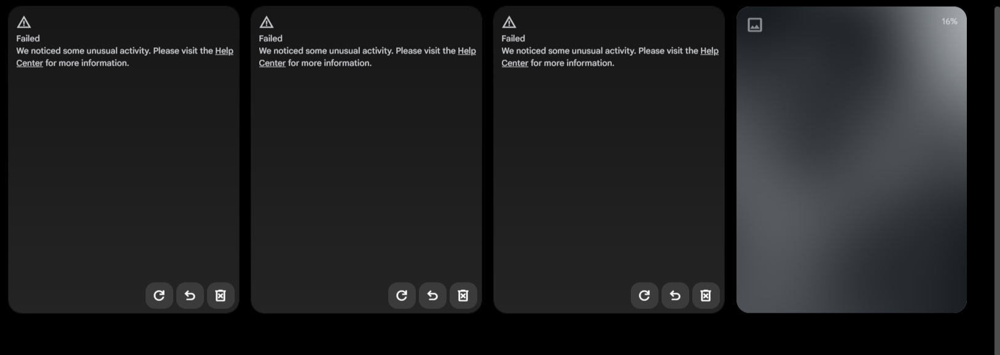

# Flow Fixer

<p align="center">
  <strong>Reliability toolkit for <a href="https://labs.google/fx/tools/flow">Google Flow</a></strong><br/>
  <sub>HAR forensics · fan-out analysis · engineering brief — not a bypass tool</sub>
</p>

<p align="center">
  <a href="https://github.com/coldbricks/flow-fixer/releases/latest/download/flow-fixer-extension.zip"></a>
  <a href="https://github.com/coldbricks/flow-fixer/releases/latest"></a>
</p>

<p align="center">
  
  
  
  
</p>

Flow Fixer measures a sharp product bug:

**Flow’s UI multiplies one human click into N scored generate calls. Flow’s abuse layer then calls that traffic “unusual activity.”**

It turns a Chrome HAR (or a live session via the extension) into the chart that makes that undeniable — soft vs hard gates, fan-position pass rates, sticky recovery.

It does **not** forge reCAPTCHA, automate generation, or dodge limits. Read-only forensics only.

Staff-eng write-up: **[docs/ENG_BRIEF.md](docs/ENG_BRIEF.md)** — the document that should produce *“ahh shit.”*

<p align="center">
  
</p>
<p align="center">
  <sub>What users see: three dead cards, Retry buttons still armed — the trap that feeds the scorer.</sub>
</p>

<p align="center">
  
</p>

### Browser extension (download from GitHub)

Live monitor **plus AUTO-THROTTLE** — speed ladder from **Molasses** to **Casey Jones**.

**1. Download the package (in your browser):**  
**[↓ flow-fixer-extension.zip](https://github.com/coldbricks/flow-fixer/releases/latest/download/flow-fixer-extension.zip)**

**2. Unzip** it somewhere permanent (e.g. `Downloads\flow-fixer-extension`).

**3. Load in Chrome / Edge / Brave:**
1. Open `chrome://extensions` (or `edge://extensions`)
2. Enable **Developer mode**
3. **Load unpacked** → select the **unzipped folder** (the one that contains `manifest.json`)
4. Open [Flow](https://labs.google/fx/tools/flow) → **hard refresh** (`Ctrl+Shift+R`)
5. Pin **Flow Fixer**

> Chrome does not allow one-click install of random zips from the internet (Web Store only). Download → unzip → Load unpacked is the supported path. Same package every release under a **stable URL** so README/links don’t break.

Details: **[extension/README.md](extension/README.md)** · rebuild zip: `pwsh scripts/package_extension.ps1`

### Python CLI (deep HAR forensics)

```bash
pip install -e .
python -m flowfixer sanitize raw.har -o safe.har
python -m flowfixer analyze safe.har
python -m flowfixer report  safe.har -o report.md
```

---

## The problem in one diagram

<p align="center">
  
</p>

Flow scores **traffic per HTTP generate call** (reCAPTCHA Enterprise → `PUBLIC_ERROR_UNUSUAL_ACTIVITY_TOO_MUCH_TRAFFIC`).  
The UI often turns **one click** into **N parallel generate calls** (multi-output ≈ 4; Retry-All ≈ 12–20), each with its own token.

That mismatch is the bug. Not “the subscriber is a botnet.”

---

## The smoking chart

Pass rate by **fire-order inside a burst** (gap ≤ 2s clusters). First call often lives. The tail dies.

<p align="center">
  
</p>

| Observation | What it means |
|-------------|----------------|
| Fresh unique reCAPTCHA tokens on failed calls | Not “stale captcha” |
| Same creative payload, mixed 200 / 429 | Outcome is *when*, not only *what* |
| Soft `USER_REQUESTS_THROTTLED` vs hard `TOO_MUCH_TRAFFIC` | Two different machines |
| Hard gate stays sticky for many minutes | “Wait a couple of minutes” is incomplete |

<p align="center">
  
</p>

Full write-up + fix proposals with acceptance tests: **[docs/ENG_BRIEF.md](docs/ENG_BRIEF.md)**

---

## Commands

| Surface | Purpose |
|---------|---------|
| **Browser extension** | Live monitor on `labs.google` — no HAR file |
| `flowfixer sanitize` | Redact cookies, auth, tokens, project/session IDs, credit numbers |
| `flowfixer analyze` | Soft vs hard vs filter · burst clusters · fan-position pass rates |
| `flowfixer report` | Markdown summary for feedback / bugs |

```bash
# never share a raw HAR
python -m flowfixer sanitize ./capture.har -o ./capture.SANITIZED.har
python -m flowfixer analyze ./capture.SANITIZED.har
```

---

## Quick start

**1. Capture** — Chrome DevTools → Network → ☑ Preserve log → reproduce → Export HAR  

**2. Sanitize** — always, before Discord/email/GitHub  

**3. Analyze** — look for `HARD_UNUSUAL`, fan-position collapse, sticky probes  

**4. Operate** — [docs/OPS_DOCTRINE.md](docs/OPS_DOCTRINE.md)  
(output = 1 under pressure · no Retry-All · hard gate → new session)

**5. Map the wire** — [docs/INTERNAL_MAP.md](docs/INTERNAL_MAP.md)

---

## For Flow / Labs engineers

If this landed on your desk, start here:

1. **[docs/ENG_BRIEF.md](docs/ENG_BRIEF.md)** — TL;DR + fan-position + acceptance tests (the “ahh shit” doc)  
2. Fan chart in this README (or run the CLI on your own HAR)  
3. Optional: load the extension, fire multi-output once, watch pos 0 live while the tail 429s  

You do not need a special quota story. You need the UI and the scorer to agree on what a click is.

Sanitized HARs + walkthrough available on request. **Read-only forensics** by design.

---

## What this is not

- Not a bot, undress tool, or “unlimited Veo” script  
- Not a reCAPTCHA solver or score spoofer  
- Not multi-account farming  
- Not legal advice  

Issues asking how to evade abuse detection will be closed. See [SECURITY.md](SECURITY.md).

---

## Project layout

```text
extension/           Chrome/Edge MV3 live monitor (load unpacked)
flowfixer/           CLI + library
docs/
  ENG_BRIEF.md       Staff-eng incident + fixes
  OPS_DOCTRINE.md    Survive the scorer
  INTERNAL_MAP.md    Wire names / flags / model keys
  assets/            Charts used in this README
fixtures/            Synthetic HAR only (no real accounts)
scripts/             Asset renderer
```

---

## Install

```bash
git clone https://github.com/coldbricks/flow-fixer.git
cd flow-fixer
python -m pip install -e .
python -m flowfixer analyze fixtures/synthetic_burst.har
```

Requires **Python 3.10+**.

Regenerate charts (optional):

```bash
python scripts/render_assets.py
```

---

## License

MIT — [LICENSE](LICENSE)

Google Flow, Veo, Gemini, and related marks are Google’s. This is an independent project.
